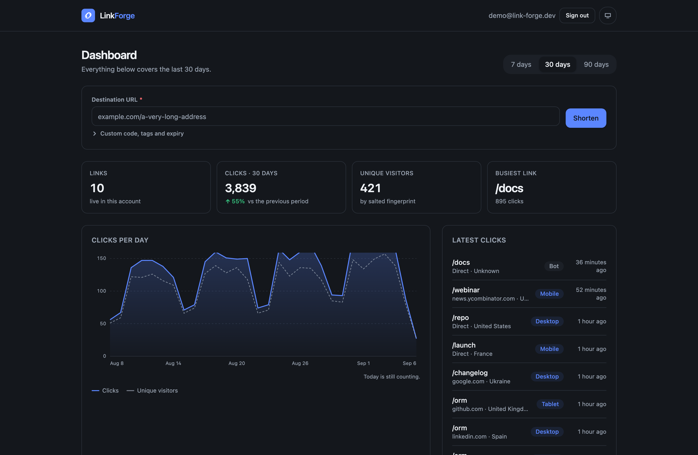
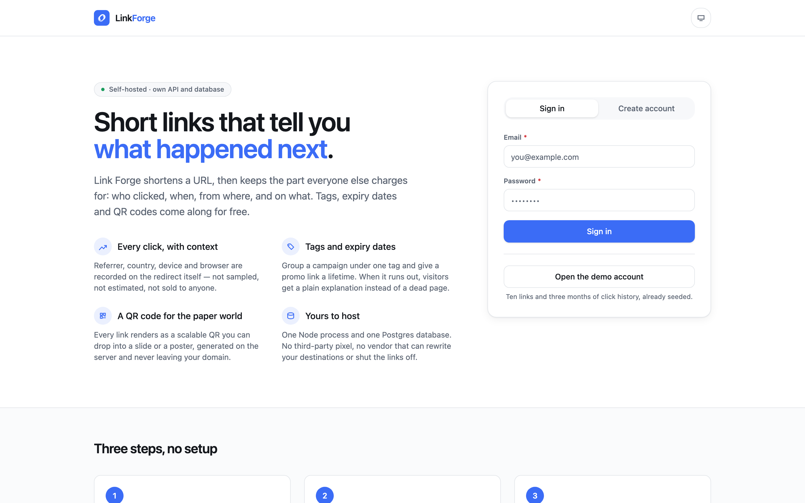
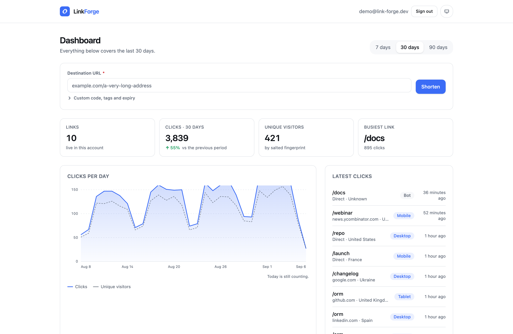
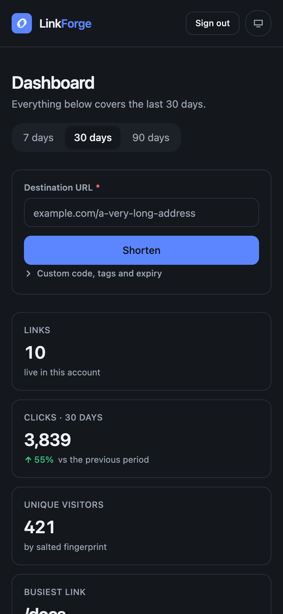

# Link Forge

Short links with the analytics that make them worth shortening — self-hosted, on
your own database. Paste a URL, get a short code, and watch the clicks arrive:
per day, per source, per country, per device, with unique visitors separated from
raw hits. Tags, expiry dates and QR codes come with it.



## Why this one exists

Most portfolio projects are a front end talking to a fixture file. This one is the
opposite half: **the API, the schema and the data are the project.** There is no
mock layer anywhere in it.

- **Four tables** — `users`, `sessions`, `links`, `clicks` — in a Postgres schema
  defined in TypeScript and versioned as SQL migrations that run on boot.
- **Sessions live in the database.** The cookie carries an opaque token; the row
  carries its SHA-256. Signing out kills the session server-side, which is exactly
  what a stateless JWT cannot do.
- **Every redirect writes a row**: referrer host, country, device, browser, and a
  salted fingerprint of the visitor. Raw IP addresses are never stored.
- **Rate limits that count the right things.** A burst of wrong passwords hits a
  wall; signing in correctly costs nothing, so a shared office address never locks
  the next person out.
- **The dashboard numbers are aggregates**, not counters kept in sync by hand. The
  chart total and the table total are the same query result, and breakdown shares
  add up to 100% because the tail is shown as its own row instead of being dropped.



## Run it

Two commands. No container, no database daemon, no configuration.

```bash
npm install
npm run dev
```

- Dashboard — <http://localhost:5173>
- API and short links — <http://localhost:8787>

The first start creates the database, applies the migrations and is ready. To fill
it with three months of plausible traffic:

```bash
npm run db:seed
```

Then sign in as **demo@link-forge.dev / forge-demo-2026**, or press *Open the demo
account* on the front page. The seed is deterministic: 10 links and roughly 7,000
clicks with weekday rhythm, a launch spike and a link that has already expired.

Node 20.19+ or 22+ is required (Vite 7).

## How it stays this simple

**The local database is real Postgres.** `@electric-sql/pglite` is Postgres
compiled to WebAssembly, running inside the Node process and persisting to
`./.data/pglite`. The same `pg-core` schema, the same generated migrations and the
same queries run against a real Postgres server the moment `DATABASE_URL` is set —
only the driver changes, in one file:

```ts
// server/db/client.ts — the app is typed against the dialect, not the driver
export type Database = PgDatabase<PgQueryResultHKT, typeof schema>
```

**The browser client is generated from the server.** Hono's RPC types flow from the
route definitions into the dashboard, so there are no hand-written response
interfaces and no duplicated shapes:

```ts
const api = hc<AppType>('/')
const { totals } = await unwrap(await api.api.stats.overview.$get({ query: { days: '30' } }))
//      ^? { links: number; clicks: number; visitors: number; trend: number }
```

Renaming a column is a compile error in the dashboard, not a blank card in
production.

## What is interesting inside

| | |
|---|---|
| **Tags** | A Postgres `text[]` column with a GIN index — one column, no join table, still indexed. Filtering is `tags @> ARRAY[$1]`. |
| **Codes** | Generated from an alphabet with no `0/O/1/l/I`, so a code survives being read aloud. Collisions retry; a taken custom code is a 409. |
| **Expiry** | An expired link answers **410 Gone** with a page that explains itself, and an unknown one **404** — never a 500 and never a blank redirect. |
| **Charts** | Hand-drawn SVG: two series, a keyboard-navigable crosshair, and a visually hidden `<table>` carrying the identical numbers for screen readers. No charting library. |
| **QR codes** | Rendered server-side as SVG and downloadable, so they scale to a poster and never leave your domain. |
| **Privacy** | Visitors are counted by `sha256(salt + ip + user-agent)` truncated to 32 characters. Country comes from the CDN's header where there is one, and falls back to `Accept-Language` locally — the dashboard says nothing it cannot back up. |

## Both themes, down to 360px

The palette is a set of tokens, so light and dark are the same components with
different values, and the choice is remembered across reloads. Every screen was
walked at 360, 768 and 1440 px, and the whole scenario — sign in, create, inspect,
delete — works from the keyboard alone.

<p>
  
  
</p>

## Commands

| Command | What it does |
|---|---|
| `npm run dev` | API on 8787 and dashboard on 5173, both restarting on change |
| `npm run build` | Typechecks both halves, then builds the dashboard into `dist/` |
| `npm start` | Production mode: one process serving the API, the redirects and the built dashboard |
| `npm test` | 22 tests — the full API against a real database, plus the dashboard components |
| `npm run lint` / `npm run typecheck` | ESLint and TypeScript, the same two the CI runs |
| `npm run db:generate` | Turns a schema change into a new SQL migration |
| `npm run db:migrate` / `npm run db:seed` | Apply migrations; load the demo data |
| `npm run db:reset` | Throw the local database away and rebuild it from migrations |

## Tests

The API tests boot the whole app against a private in-memory Postgres — no mocked
database, no stubbed queries — and walk the scenario a user actually performs:
create a link, follow it, see the click land in the dashboard attributed to its
source, then delete it and watch its history go with it. The rest cover the parts
that are easy to get wrong: ownership (knowing another account's link id gets you
nothing), identical answers for a wrong password and an unknown account, and both
rate limits.

Measured on the production build: Lighthouse **93 performance / 100 accessibility /
100 best practices / 100 SEO** on the front page, and **93 / 100 / 100** on the
dashboard. The whole dashboard is 87 kB of JavaScript gzipped.

## Deploy

The app is a long-running Node process with a Postgres database, so it wants
anywhere that runs a container — a static host is the wrong shape for it. A
`Dockerfile` and a `fly.toml` are included:

```bash
fly launch --no-deploy      # takes the app name and region from fly.toml
fly postgres create && fly postgres attach --app link-forge
fly secrets set PUBLIC_BASE_URL=https://your-domain
fly deploy
```

Migrations run at startup, so a fresh database needs no release step.
`PUBLIC_BASE_URL` must be the origin that serves the redirects — short links are
built from it.

There is no public demo link: the repository is private and the deployment is one
account login away from existing. Everything up to that point is committed and
verified, including a production build that was run and clicked through locally.

## Layout

```
server/
  app.ts            routes, session middleware, error handling
  db/               schema, migrations runner, deterministic seed
  routes/           auth · links · stats · redirect
  lib/              sessions, password hashing, rate limiter, analytics queries
  __tests__/        the whole app against a real database
web/src/
  api/              the client generated from the server's route types
  features/         landing, dashboard, links
  ui/               chart, sparkline, stats, page shell
  components/       shared component library
drizzle/            generated SQL migrations
```

## Configuration

Everything has a working default; `.env.example` lists the whole surface.

| Variable | Default | Meaning |
|---|---|---|
| `PUBLIC_BASE_URL` | `http://localhost:8787` | Origin short links are built on |
| `PORT` | `8787` | Port the API listens on |
| `DATABASE_URL` | *(empty)* | Empty uses the embedded Postgres; set it for a server |
| `SECURE_COOKIES` | on in production | Marks the session cookie `Secure` |
| `VISITOR_SALT` | dev value | Salt for the visitor fingerprint — set it in production |
